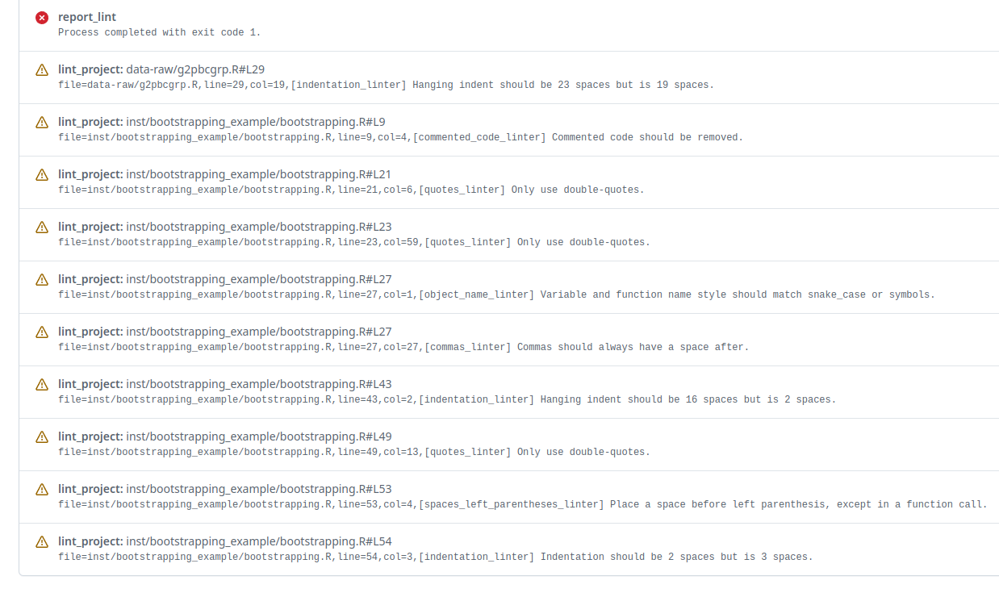
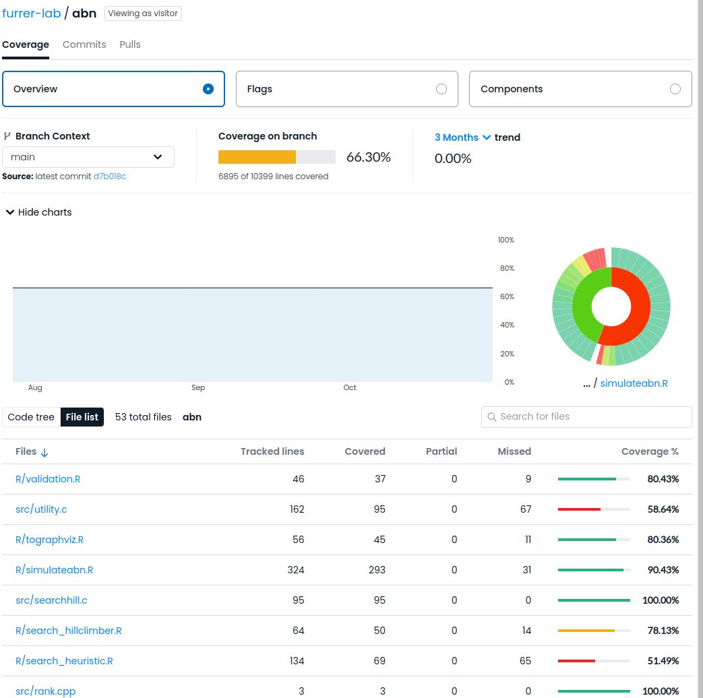

:::{card}####  Increased Quality
- **Enforce Coding Standards**: Formatting, naming conventions, code organization.Automation tools can enforce coding standards, such as formatting, naming conventions, and code organization, ensuring that the codebase is consistent and easy to read.
- **Check code quality**: Fode coverage, linting, quality metrics.Automation tools can perform static code analysis, including checks for code coverage[^sn1], linting[^sn2], and other quality metrics, helping to identify and fix issues before they become problems.

[^sn1]: _Code coverage_ measures the percentage of code that is executed during automated tests, helping to identify untested parts of the codebase.
[^sn2]: _Linting_ is the process of analyzing code for potential errors, stylistic issues, and adherence to coding standards.
:::



::::{grid}
:::{grid-item-card} Linting Output

:::
:::{grid-item-card} Code Coverage Output 

:::
::::

