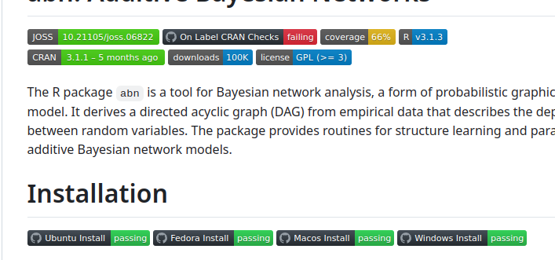

:::{card}#### Transparency
- **Visibility into Workflows**: Transparent testing, building, and deploying procedures.Automation scripts transparently define testing, building and deploying procedures, providing end-to-end visibility and insight.
- **Visibility into Process States**: Updated insights into the status of build, test, deployment or other processes.Automated pipelines and dashboards provide updated insights into the status of builds, tests, deployments and other type of processes, making it easier for stakeholders to understand project progress.
:::


:::{grid}
:::{grid-item-card} 

:::
:::

